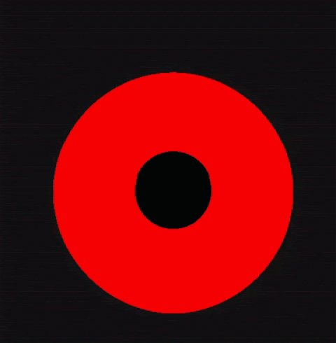

## Black Hole Simulation

This is a ray-tracer I built that takes into account the curved geometry of spacetime to iteratively integrate the path of a light ray until it collides with something.
Once a collision occurs, the color of the origin pixels gets set to the color of the object the light ray collided with. 


The core computation essentially happens in this section of code in `kernel.cu`
```cpp
float k1[6], k2[6], k3[6], k4[6];
const float halfstep = 0.5f * STEP;
getGeodesicDerivatives(r, theta, phi, dr, dtheta, dphi, f, dt_dL, k1);
getGeodesicDerivatives(r + halfstep*k1[0], theta + halfstep*k1[1], phi + halfstep*k1[2], dr + halfstep*k1[3], dtheta + halfstep*k1[4], dphi + halfstep*k1[5], f, dt_dL, k2);
getGeodesicDerivatives(r + halfstep*k2[0], theta + halfstep*k2[1], phi + halfstep*k2[2], dr + halfstep*k2[3], dtheta + halfstep*k2[4], dphi + halfstep*k2[5], f, dt_dL, k3);
getGeodesicDerivatives(r + STEP*k3[0], theta + STEP*k3[1], phi + STEP*k3[2], dr + STEP*k3[3], dtheta + STEP*k3[4], dphi + STEP*k3[5], f, dt_dL, k4);    

const float onesixth = STEP / 6.0f;
r += onesixth * (k1[0] + 2.0f*k2[0] + 2.0f*k3[0] + k4[0]);
theta += onesixth * (k1[1] + 2.0f*k2[1] + 2.0f*k3[1] + k4[1]);
phi += onesixth * (k1[2] + 2.0f*k2[2] + 2.0f*k3[2] + k4[2]);
dr += onesixth * (k1[3] + 2.0f*k2[3] + 2.0f*k3[3] + k4[3]);
dtheta += onesixth * (k1[4] + 2.0f*k2[4] + 2.0f*k3[4] + k4[4]);
dphi += onesixth * (k1[5] + 2.0f*k2[5] + 2.0f*k3[5] + k4[5]);   

float sintheta_this = sinf(theta);

pos.x = r * sintheta_this * cosf(phi);
pos.y = r * sintheta_this * sinf(phi);
pos.z = r * cosf(theta);
```